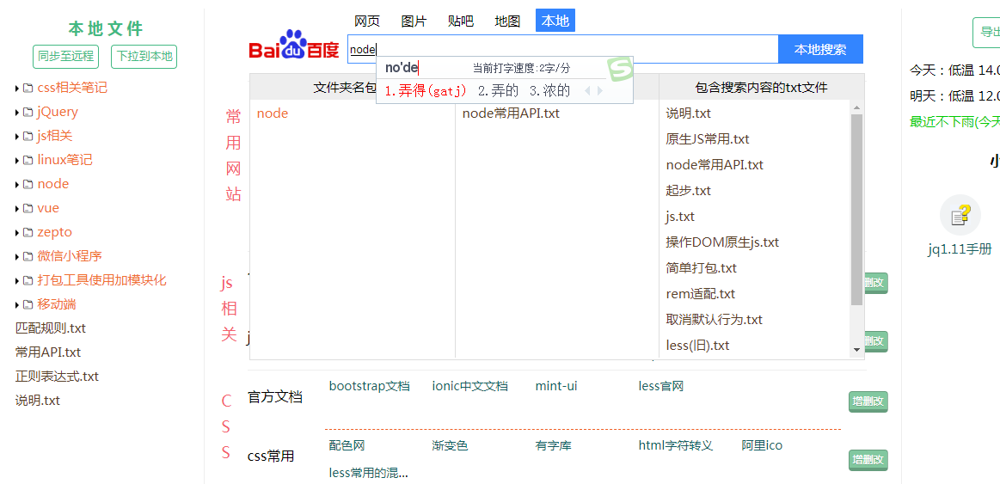

## 全自定义导航
	#放在前面说：主要写给自己用+练手，不考虑低版本浏览器兼容性。es5、es6混写，没有使用babel转换

#### 简单演示： [静态页大部分功能不能用](https://huanghb258.github.io/demo)
	
## 主要功能：

* 1.模拟百度搜索框全功能，最重要的是添加`本地搜索`功能，支持搜索文件夹、文件(仅.html和.txt),txt文件内容。当然，前提是必须将文件放到指定目录。

* 2.自定义常用网址，增加、删除、调整位置顺序随心所欲，使用localStorage存储，可导出到JSON，走到哪都能同步

* 3.左边栏是最主要的点，支持读取本地文件生成列表到左侧，可以右键直接打开txt文件或目录，txt文件能直接渲染到页面，并作简单的修饰，相比直接用文本文档打开大大的提升可阅读性。不过完全根据自己使用习惯进行修饰，具体看匹配规则.txt
	
	
	*	平时喜欢用文本文档作笔记，写多了要用时自己都找不到。现在直接生成到页面加上搜索功能，完美解决

* 4.右边栏，近期下雨红字提示，小工具：适合放一些其它类型文档，比如chm手册，可惜运行不了可执行文件(应该是为了安全考虑)
	*	小工具栏目前只是雏形，有空再弄

* 5.最下方工具栏：还没想好放什么


## 使用：
``` bash
	`运行环境`：
		装个node就行了，如果可以再装个pm2更好:npm install pm2 -g
		注：只在win7和win10上测试使用过

	`目录结构`：
		新建myProjects文件夹，将nav-server整个文件夹放在myProjects文件夹根目录，myProjects位置随意，但不能放在带中文的文件夹下	
		
	打开命令窗口，cd到nav-server目录下：
		#安装依赖
		npm install

		#直接运行node服务，运行后命令窗口不能关，如果安装了pm2，跳过看下一步
		npm start

		`如果安装了pm2`：
		#使用pm2启动，启动后可关闭命令窗口	
		pm2 start pm2.json

	#不出意外的话就可以访问了
		访问地址：127.0.0.1:3000
```

### 简单演示： [演示](https://huanghb258.github.io/demo)

## 下面的注意事项一定要看：
*	很多功能其实是在执行cmd命令，不同平台命令可能存在差别

*	慎用左侧同步至远程按钮，其实是执行bat目录下的bat文件，使用前最好先看下push.bat文件

*	遍历文件时以下文件会被排除：
	*	文件夹名称为 img、js、css以及以点开头的文件夹
	*	且只加载.txt和.html文件

*	txt文件必须是utf-8格式，否则中文出现乱码，点击文件另存为可以转换格式，修改文档无需刷新整个页面
		
*	在win7下使用打开文件或目录功能cmd窗口会闪一下，win10好好的

*	百度搜索框5分钟后会自动切换回见网页搜索，毕竟其它搜索用的少

*	未考虑大txt文件，懒得做分页显示，你要放个好几兆大小的txt文档进去卡死活该

*	...先想到这，反正估计就我自己一个人用

		